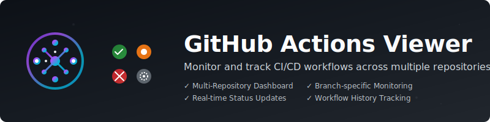
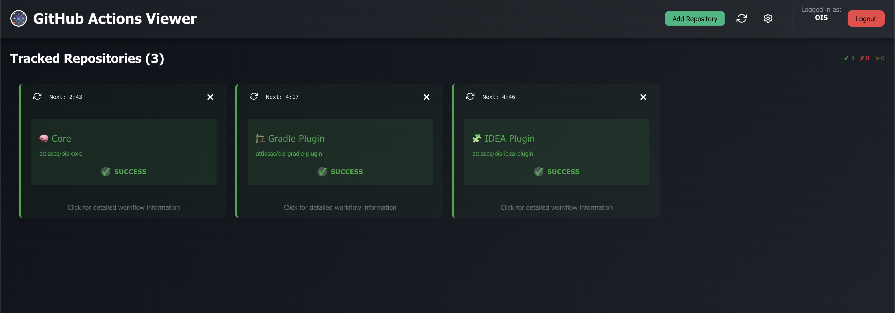

  

# GitHub Actions Viewer

**Monitor all your GitHub Actions in one beautiful dashboard.**

GitHub Actions Viewer is the easiest way to track, visualize, and manage your CI/CD pipelines across multiple repositories and GitHub servers. Get real-time status, branch and workflow insights, and never miss a failed build again.

---

## 🚀 Try It Now!

**No build required!** Download the latest release for your platform and get started in seconds:

- [Download for macOS (Apple Silicon)](https://github.com/attiasas/github-action-viewer/releases/latest)  
- [Download for Linux (x64)](https://github.com/attiasas/github-action-viewer/releases/latest)  
- [Download for Windows (x64)](https://github.com/attiasas/github-action-viewer/releases/latest)

Or [browse all releases and platforms](https://github.com/attiasas/github-action-viewer/releases).

---

## Why You'll Love It

- **One Dashboard, All Your Repos**: See the status of all your GitHub Actions at a glance.
- **Multi-Server Support**: Connect to GitHub.com and GitHub Enterprise.
- **Branch & Workflow Filtering**: Track only what matters to you.
- **Auto-Refresh & Real-Time Stats**: Always up to date.
- **Secure & Local**: Your data stays on your machine.
- **Modern, Responsive UI**: Works great on desktop.

---

## Screenshots

---

## Quick Start

1. **Download** the latest release for your OS from [GitHub Releases](https://github.com/attiasas/github-action-viewer/releases/latest).
2. **Extract** the windows archive (if needed) and run:
   - On macOS/Linux: `./start.sh` or the portable executable
   - On Windows: `start.bat`
3. Open your browser to [http://localhost:3000](http://localhost:3000) (opens automatically by default)
4. **Create your account** and start adding GitHub servers and repositories!

See [BUILD.md](BUILD.md) for advanced build instructions.

---

## Documentation & Help

- [Troubleshoot](BUILD.md#troubleshooting)
- [How to Build](BUILD.md)
- [How to Contribute](CONTRIBUTE.md)
- [Report Issues](https://github.com/attiasas/github-action-viewer/issues)
