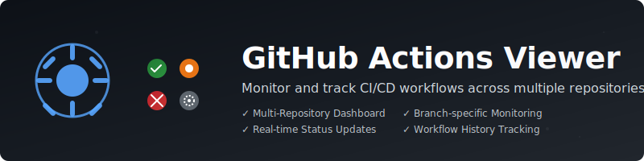

# GitHub Actions Viewer

A full-stack web application for monitoring GitHub Actions across multiple repositories and GitHub servers. View action statuses, track specific workflows and branches, and get real-time updates on your CI/CD pipelines.

## Features

- **Multi-Repository Monitoring**: Track GitHub Actions across multiple repositories from a single dashboard
- **Multi-Server Support**: Connect to multiple GitHub servers (GitHub.com, GitHub Enterprise, etc.)
- **User Authentication**: Secure login with username and password
- **Branch-Specific Tracking**: Monitor specific branches for each repository
- **Workflow Filtering**: Choose which workflows to track (or monitor all)
- **Auto-Refresh**: Configurable automatic refresh intervals
- **Persistent Configuration**: User settings and repository configurations are saved between sessions
- **Real-Time Statistics**: View success/failure counts and latest run information
- **Modern UI**: Clean, responsive interface built with React and TypeScript

## Technology Stack

- **Frontend**: React 18 with TypeScript, Vite for build tooling
- **Backend**: Node.js with Express
- **Database**: SQLite for persistent storage
- **Authentication**: Secure password-based authentication with bcrypt
- **Styling**: CSS3 with modern design patterns

## Prerequisites

- Node.js (v20.15.1 or higher)
- npm (v10.7.0 or higher)
- GitHub personal access tokens with `repo` scope for each GitHub server you want to monitor

## Installation and Setup

1. **Clone the repository**:
   ```bash
   git clone <repository-url>
   cd github-action-viewer
   ```

2. **Install dependencies**:
   ```bash
   npm install
   ```

3. **Start the backend server**:
   ```bash
   npm run dev:server
   ```

4. **In a new terminal, start the frontend**:
   ```bash
   npm run dev
   ```

5. **Or start both simultaneously**:
   ```bash
   npm run dev:both
   ```

6. **Access the application**:
   Open your browser and navigate to `http://localhost:5173`

## Usage

### First Time Setup

1. **Create Account**: 
   - Open the application and click "Create Account"
   - Choose a unique User ID and secure password
   - Your account will be created locally

2. **Add GitHub Servers**:
   - Go to Settings after logging in
   - Click "Add GitHub Server" 
   - Enter server details:
     - **Server Name**: A friendly name (e.g., "GitHub.com", "Company GitHub")
     - **Server URL**: `https://github.com` for GitHub.com or your GitHub Enterprise URL
     - **API Token**: Your GitHub personal access token
     - **Set as Default**: Check if this should be your primary server

3. **Generate GitHub Access Token**:
   - Go to GitHub Settings → Developer settings → Personal access tokens
   - Click "Generate new token (classic)"
   - Select required scopes:
     - `repo` (for accessing private repositories and their Actions)
     - OR `public_repo` (if you only need access to public repositories)
   - Copy the generated token and use it when adding a GitHub server

### Adding Repositories

1. Use the repository search bar on the dashboard
2. Select a GitHub server from the dropdown
3. Search for repositories you have access to
4. Select a repository to configure tracking options:
   - Choose which branches to monitor
   - Select specific workflows (optional - all workflows monitored by default)
   - Set auto-refresh interval
5. Click "Add Repository" to start tracking

### Dashboard Features

- **Overview Statistics**: See aggregate success/failure counts across all tracked repositories
- **Repository Cards**: Click to expand and view detailed branch-specific statistics
- **Auto-Refresh**: Automatically updates statistics based on your configured interval
- **Manual Refresh**: Click "Refresh Now" for immediate updates

### Settings

Access the settings page to:
- **Manage GitHub Servers**: Add, edit, delete, and test GitHub server configurations
- **Update Preferences**: Change default refresh interval and theme
- **Enable Notifications**: Configure notification settings (feature coming soon)
- **View Application Info**: See version and feature information

## API Endpoints

The application provides a REST API with the following endpoints:

### Authentication
- `POST /api/auth/register` - Register new user
- `POST /api/auth/login` - User login
- `GET /api/auth/user/:userId` - Get user information
- `GET /api/auth/github-servers/:userId` - Get user's GitHub servers
- `POST /api/auth/github-servers` - Add GitHub server
- `PUT /api/auth/github-servers/:serverId` - Update GitHub server
- `DELETE /api/auth/github-servers/:serverId` - Delete GitHub server
- `GET /api/auth/test-token/:serverId` - Test GitHub server token

### Repositories
- `GET /api/repositories/search` - Search GitHub repositories
- `GET /api/repositories/:owner/:repo/workflows` - Get repository workflows
- `GET /api/repositories/:owner/:repo/branches` - Get repository branches
- `POST /api/repositories/track` - Add repository to tracking
- `GET /api/repositories/tracked/:userId` - Get user's tracked repositories
- `DELETE /api/repositories/tracked/:userId/:repoId` - Remove tracked repository

### Actions
- `GET /api/actions/runs/:owner/:repo` - Get workflow runs
- `GET /api/actions/stats/:userId` - Get aggregated statistics

### User Settings
- `GET /api/users/settings/:userId` - Get user settings
- `PUT /api/users/settings/:userId` - Update user settings

## Database Schema

The application uses SQLite with the following tables:

- **users**: User accounts with encrypted passwords
- **github_servers**: GitHub server configurations with API tokens
- **user_repositories**: Tracked repositories linked to specific GitHub servers
- **user_settings**: User preferences and settings

## Development

### Project Structure

```
github-action-viewer/
├── src/                    # Frontend React application
│   ├── components/         # Reusable React components
│   ├── contexts/          # React contexts (Auth)
│   ├── pages/             # Page components
│   └── App.tsx            # Main application component
├── server/                # Backend Node.js application
│   ├── routes/            # API route handlers
│   ├── database.js        # Database setup and connection
│   └── index.js           # Main server file
└── public/                # Static assets
```

### Available Scripts

- `npm run dev` - Start frontend development server
- `npm run dev:server` - Start backend server
- `npm run dev:both` - Start both frontend and backend
- `npm run build` - Build for production
- `npm start` - Start production server
- `npm run lint` - Run ESLint

### Environment Variables

No environment variables are required for basic functionality. The application uses SQLite for data persistence and creates the database file automatically.

## Security Considerations

- User passwords are hashed using bcrypt with salt rounds
- GitHub access tokens are stored locally in the SQLite database
- Tokens are transmitted over HTTPS when making GitHub API requests
- User data is stored locally and not transmitted to external services
- Consider implementing token encryption for production use
- Each user can only access their own GitHub servers and repositories

## Troubleshooting

### Common Issues

1. **403 Forbidden Error (Access Denied)**:
   - **Token Permissions**: Ensure your GitHub token has the required permissions:
     - `repo` scope for accessing private repositories and their Actions
     - `public_repo` scope if you only need access to public repositories
   - **Rate Limiting**: GitHub API has rate limits (5,000 requests/hour for authenticated users)
     - Check rate limit status in the error message
     - Wait for rate limit reset or use a different token
   - **Repository Access**: Verify you have access to the repositories you're trying to search
   - **Token Validity**: Check if your token is expired or revoked

2. **401 Unauthorized Error**:
   - **Invalid Token**: Your GitHub token may be incorrect, expired, or revoked
   - **Wrong Server URL**: Verify the GitHub server URL is correct
   - **Token Format**: Ensure token starts with `ghp_` for personal access tokens

3. **API Rate Limiting**: GitHub API has rate limits. Use authenticated requests and consider implementing caching for production use.

4. **Token Permissions**: Ensure your GitHub token has the required scopes:
   - `repo` for accessing private repositories and their Actions
   - `public_repo` if you only need access to public repositories

5. **CORS Issues**: The development server is configured with a proxy. For production, ensure proper CORS configuration.

6. **Database Issues**: The SQLite database is created automatically. Check file permissions if you encounter database errors.

7. **Branches Not Loading**: 
   - Use the "Test Token" feature to validate your GitHub credentials
   - Check if the repository exists and you have access to it
   - Try manually adding branch names if auto-detection fails

### Debugging Steps

1. **Use the Token Validator**: Each GitHub server has a "Test Token" button to validate credentials
2. **Check Browser Console**: Look for detailed error messages in the browser's developer console
3. **Verify Token Scopes**: Ensure your tokens have the minimum required scopes:
   ```
   repo (Full control of private repositories)
   OR
   public_repo (Access to public repositories)
   ```
4. **Test with Public Repository**: Try searching for a public repository first to isolate permission issues
5. **Check Server Configuration**: Verify GitHub server URLs are correct in Settings

## Contributing

1. Fork the repository
2. Create a feature branch
3. Make your changes
4. Add tests if applicable
5. Submit a pull request

## License

This project is licensed under the MIT License.

## Future Enhancements

- Email/webhook notifications for failed actions
- Historical data tracking and trends
- Team collaboration features
- Docker containerization
- Advanced filtering and search capabilities
- Mobile-responsive design improvements
